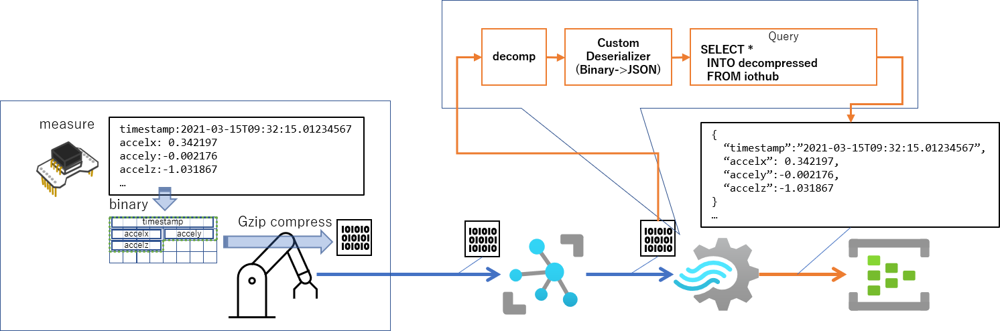
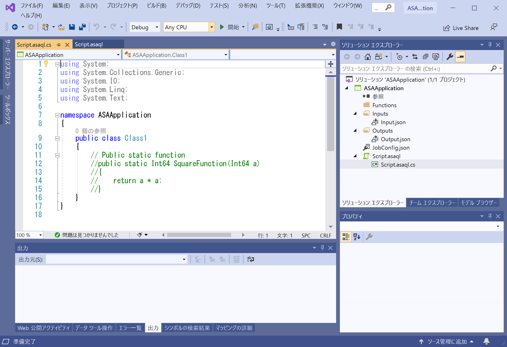
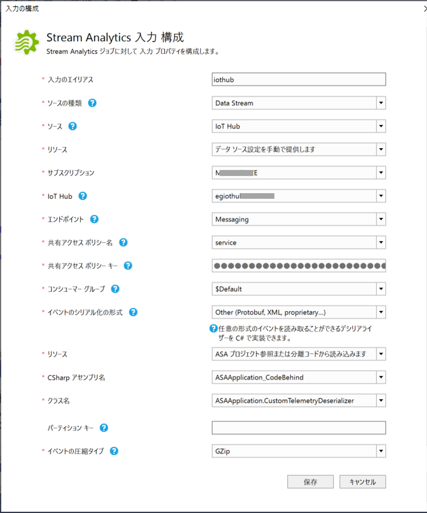
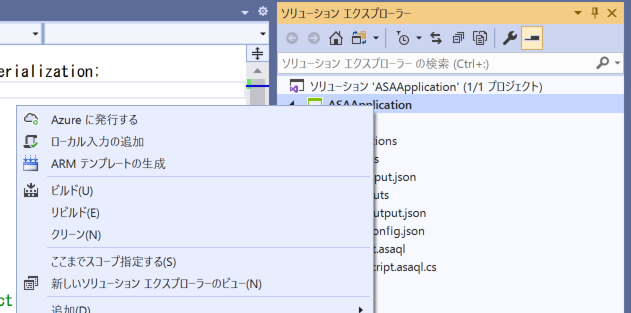
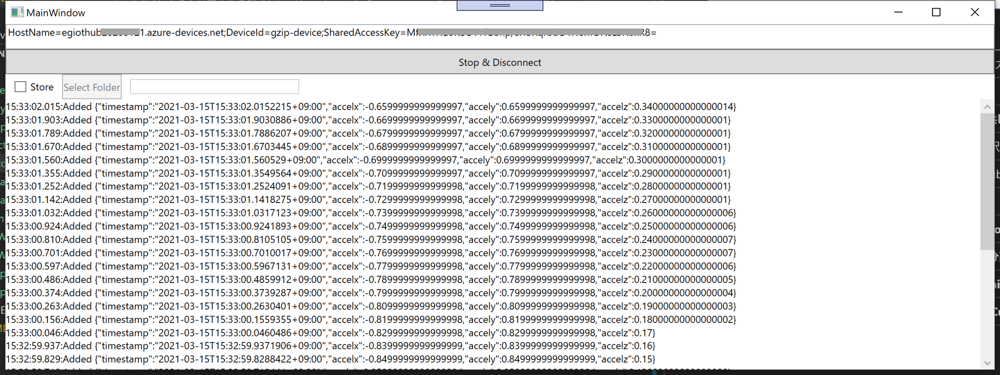

# Azure Stream Analytics GZIP 圧縮された入力のデシリアライズサンプル

GZIPで圧縮されたバイナリーデータを入力として受け取り、解凍して、JSONとして出力するサンプル。  
IoT シナリオで、例えば usec オーダーで振動加速度等をセンサーで収集した生データをクラウドに送信し蓄積する場合、デバイスからJSONで送信しようとすると膨大なバイト数のデータを送信することになり、通信回線への負担、IoT Hub での受信可能メッセージ数の浪費などの問題が発生する。そんな問題を回避したい場合に参考となるサンプルを紹介する。  



デバイスで、3軸の加速度センサーで振動を一定間隔で計測する。  
- timestamp - 計測した時間
- accelx - X軸加速度
- accely - Y軸加速度
- accelz - Z軸加速度  

これらのデータ項目を、  
|データ項目|バイナリ化|
|-|-|
|timestamp|[.NET Framework の DateTime の Ticks 形式](https://docs.microsoft.com/en-us/dotnet/api/system.datetime.ticks?view=net-5.0)(8byte)|
|accelx|float(4byte)|
|accely|float(4byte)|
|accelz|float(4byte)|

で 1 計測データあたり、20 byte で時系列で並べていき、一定数、または、一定サイズを超えたら、そのバイナリデータを GZIP で圧縮し、IoT Hub に圧縮したデータを D2C メッセージとして送信する。  
Stream Analytics で、GZIP解凍、カスタムデシリアライザーを使ったバイナリデータ⇒JSON形式への変換、クエリーによるデータ処理（本サンプルではそのままスルー）、後段への出力を行う。  
カスタムデシリアライザーは、「[.NET カスタム逆シリアライザーを使用して任意の形式の入力を読み取る](https://docs.microsoft.com/ja-jp/azure/stream-analytics/custom-deserializer-examples)」を参照の事。  

---

## 事前準備  
入力用の IoT Hub と出力用の Event Hub はあらかじめ作成しておくこと。  
Stream Analytics は作成しなくてよい。  
## Custom Deserializer の作成  
※ 本記述は、2021/3/15時点の状況を元に記載している。今読まれている時点が非常に時が経っていたら、もしかすると色々と更新されているかもしれないのでDocs等自分で確認していただきたい。

現状、Custom Desierializer は、Azure Portal では設定できず、配置も含め、VS Code ＋ Extension、もしくは、Visual Studio 2019＋拡張機能でしか作成できない。ここでは、Visual Studio 2019 での開発手順を紹介する。
Visual Studio 2019 で Azure Stream Analytics Application を開発するには、 <b>Azure Data Lake and Stream Analytics Tools</b> を拡張機能でインストールする。これをインストールすると、<b>Azure Stream Analytics Custom Deserializer Project(.NET) </b>というプロジェクトテンプレートが追加されるので、それを使いたくなるのだが、どうもうまく配置できなかったので、<b>EAzure Stream Analytics Application</b>プロジェクトテンプレートを使う方法を紹介する。  
プロジェクトを作成すると以下の様な状態で作成される。  



## Custom Deserializer の実装  
Script.asaql のコードビハインドを開いて、ここに Custom Desierializer のコードを記述する。  
先頭の using のパートに以下を追加する。  
```cs
using Microsoft.Azure.StreamAnalytics;
using Microsoft.Azure.StreamAnalytics.Serialization;
```
JSON で出力するためのデータモデルを追加する。  
```cs
    public class TelemetryDataStructure
    {
        public DateTime timestamp { get; set; }
        public double accelx { get; set; }
        public double accely { get; set; }
        public double accelz { get; set; }
    }
```

Stream Analytics がデータを受信したときにそのデータを受け取って変換するためのクラスを追加する。  
```cs
    public class CustomTelemetryDeserializer : StreamDeserializer<TelemetryDataStructure>
    {
        // streamingDiagnostics is used to write error to diagnostic logs
        private StreamingDiagnostics streamingDiagnostics;

        // Initializes the operator and provides context that is required for publishing diagnostics
        public override void Initialize(StreamingContext streamingContext)
        {
            this.streamingDiagnostics = streamingContext.Diagnostics;
        }

        // Deserializes a stream into objects of your type
        public override IEnumerable<TelemetryDataStructure> Deserialize(Stream stream)
        {
            var buf = new byte[stream.Length];
            var readBytes = stream.Read(buf, 0, (int)stream.Length);
            var processedBytes = 0;
            var unitSize = sizeof(float);
            var timestampSize = sizeof(long);
            while (processedBytes + unitSize * 3 + timestampSize < readBytes)
            {
                var value = new TelemetryDataStructure();
                long ticks = BitConverter.ToInt64(buf, processedBytes);
                processedBytes += timestampSize;
                var timestamp = new DateTime(ticks);
                var accelx = BitConverter.ToSingle(buf, processedBytes);
                processedBytes += unitSize;
                var accely = BitConverter.ToSingle(buf, processedBytes);
                processedBytes += unitSize;
                var accelz = BitConverter.ToSingle(buf, processedBytes);
                processedBytes += unitSize;
                yield return new TelemetryDataStructure()
                {
                    timestamp = timestamp,
                    accelx = accelx,
                    accely = accely,
                    accelz = accelz
                };
            }
            if (processedBytes == 0 || processedBytes != stream.Length)
            {
                streamingDiagnostics.WriteError("data format error", processedBytes == 0 ? $"processed data size is 0 for {stream.Length}" : $"data size mismatched {processedBytes}<->{stream.Length}");
            }
        }
    }
```
Stream Analytics が受信したデータを、Stream Analytics が標準で持っているGZIP解凍機能を使って解凍されたバイナリーデータは受信の度に、Deserializeメソッドの引数の stream から取得できる。  
受信するデータは、前述の通り、最初の8バイトが timestamp の Tick、次に、4バイトずつ、accelx、accely、accelz と続く、20バイトを順に読み込んで、JSON 化、それを受け取ったデータ分繰り返す。  
ちなみに、上に挙げたコードの中の、
```cs
                yield return new TelemetryDataStructure()
                {
                    timestamp = timestamp,
                    accelx = accelx,
                    accely = accely,
                    accelz = accelz
                };
```
がそれにあたり、<b>yield</b> をつけることによって、20バイトの塊ごとに Deserialize メソッドのコール側に逐次返しつつ（返されたデータに、Stream Analytics のクエリーで定義されたデータ処理が適用される）、このメソッドの実行が継続される。  
次に、<b>Script.asaql</b> を開き、
```sql
SELECT * INTO unziped FROM iothub
```
と入力する。"ビルド"→"ソリューションのビルド"で、プロジェクトをビルドする。  
※ このファイルを空にしておくとビルドでエラーが出てしまうので入力定義の前にやっておく。

# 入力の定義  
Inputs/Input.json をクリックしてダイアログを表示し、設定を行う。 


|項目|設定方法|
|-|-|
|入力のエイリアス|クエリーに合わせ、<b>iothub</b>と入力|
|ソース|<b>IoT Hub</b>を選択|
|リソース|<b>データソース設定を手動で提供します</b>を選択|
|サブスクリプション|各自のサブスクリプションを選択|
|IoT Hub|入力としてバインドする IoT Hub を選択|
|共有アクセスポリシー|<b>service</b> を選択|
|イベントのシリアル化の形式|<b>Other (Protobuf, XML, proprietary...)</b> を選択|
|リソース|<b>ASA プロジェクト参照または分離コードから読み込みます</b>を選択|
|CSharp アセンブリ名|<b>ASAApplication_CodeBehind</b>を選択|
|クラス名|<b>Script.asaql.cs</b> で追加した <b>CustomTelemetryDeserializer</b>クラス|
|イベントの圧縮タイプ|<b>GZip</b>|

### 出力の定義  
Outputs/Output.json をクリックしてダイアログを表示し、<b>unziped</b> というエイリアスで出力用の Event Hubをバインドする。  

### Azure へのデプロイと実行  
ソリューションエクスプローラ―で、Stream Analytics Application プロジェクトを右クリックし、<b>Azureに発行する</b>を選択し、デプロイする。  


最初の一回目は、新規作成、二回目以降は、更新でよい。  
デプロイが完了したら、Stream Analytics を実行する。  
※ 実行中は課金が発生するので、お試しが終わったら停止しておくことを推奨する。  

---
## デバイスシミュレータ 
[テスト用のシミュレータ](simulator/WpfAppDeviceSimulator]を用意しているので、お試しはそちらで。  
Visual Studio 2019 で [WpfAppDeviceSimulator.csproj](simulator/WpfAppDeviceSimulator/Simulator.csproj)を開き、42行目付近の  
```cs
        private string iothubconnectionstring = "<- connection string for device of IoT Hub ->";
```
の文字列を、IoT Hub に一つ適当に <b>IoT Device</b> を追加して、その接続文字列で置き換え、実行する。  
<b>Connect & Start</b> をクリックすると、送信を開始する。  
  


---
## 留意点  
現状、カスタムデシリアライザーが利用可能な Stream Analytics は、データセンターが限られている。  
利用可能なデータセンターは、[リージョンのサポート](https://docs.microsoft.com/ja-jp/azure/stream-analytics/custom-deserializer-examples#region-support)を確認してください。  

